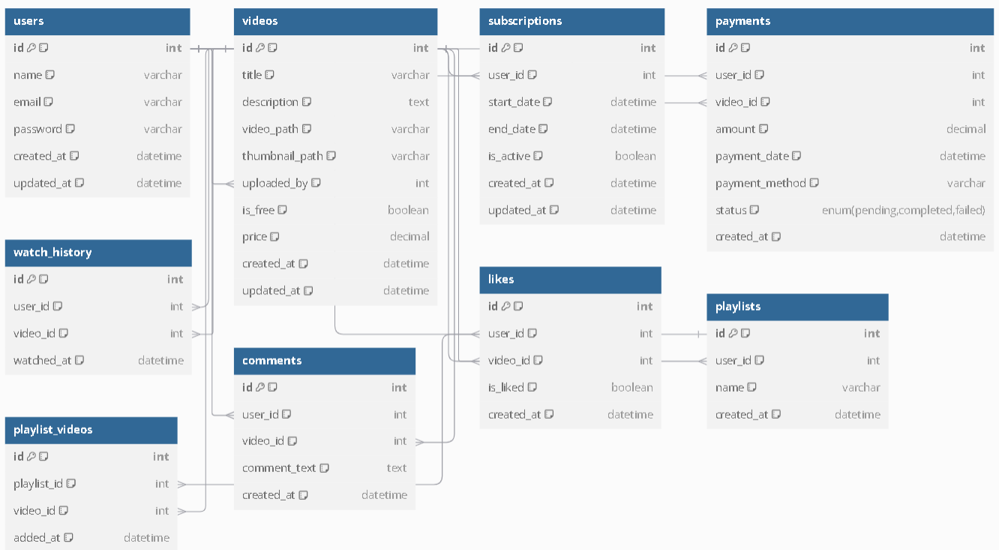

# Proyecto de Streaming

Este es un proyecto para una aplicación de streaming que permite a los usuarios ver videos, dar "likes", manejar suscripciones, pagos y almacenar videos de manera privada. El proyecto también implementa integraciones con servicios como American Express para el procesamiento de pagos.

## Fechas importantes

### 3 de diciembre
- **Tareas en Progreso:**
  - Diseñar las maquetas para la aplicación de streaming.
  - Diseñar las rutas para las vistas:
    - `GET /feed/main`: Obtener el feed principal de videos.
    - `POST /videos/create`: Crear un video con metadata.
    - `POST /videos/like`: Dar "like" a un video.
    - `POST /payments/american-express`: Consumir la API de American Express para pagos.
    - `POST /subscriptions`: Definir qué suscripción tiene un usuario.
    - `POST /payments/subscription`: Persistir pagos de suscripción en la base de datos.
    - `POST /videos/private`: Videos privados para el usuario.
    - `POST /videos/private/subscribers`: Videos privados para suscriptores específicos.
    - `POST /favorites`: Agregar un video a Favoritos.
  - **General:**
    - `POST /categories`: Definir categorías para los videos.

### 4 de diciembre
- **Tareas:**
  - Agregar configuraciones de variables de entorno (envs).
  - Integrar Base de Datos y Configuración de rutas esenciales de Ingreso.

## Estructura de la base de datos

La siguiente es una representación visual de la estructura de la base de datos para este proyecto:



## Cómo empezar

1. Clona este repositorio en tu máquina local:
   ```bash
   git clone <repositorio-url>
